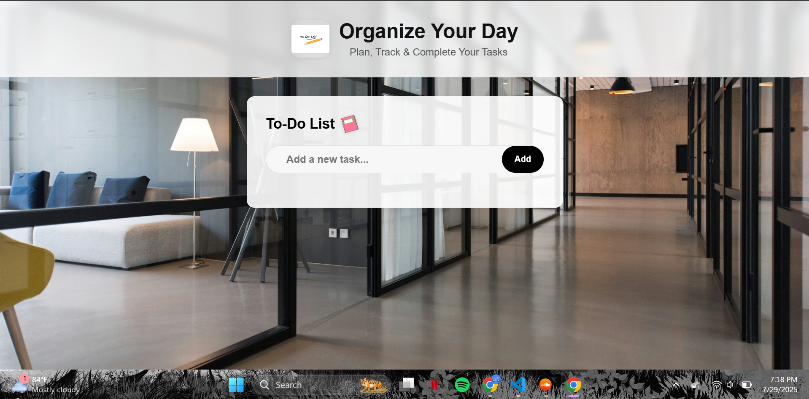
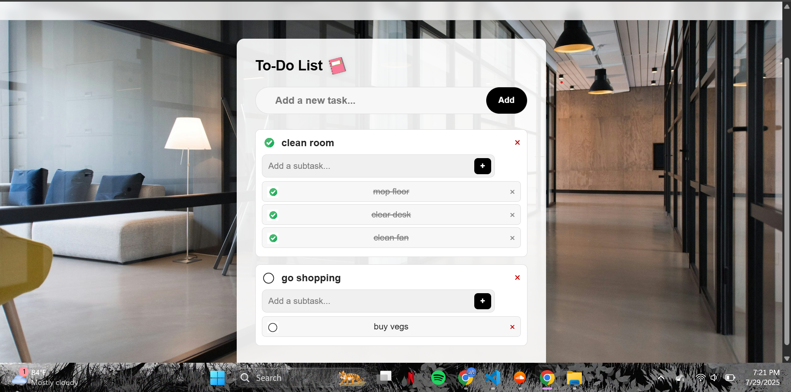

# 📝 To-Do List Web App

A modern, minimalistic **To-Do List** web application designed to help you organize, track, and complete tasks efficiently. The app supports **main tasks**, **nested subtasks**, and **persistent storage** using the browser's local storage.

---

## 🚀 Features

- ✅ **Add Main Tasks**: Quickly add tasks with a simple input and button.  
- ✅ **Checkbox for Completion**: Click the checkbox to mark a task as completed or uncheck to undo.  
- ✅ **Subtasks Support**: Add unlimited subtasks under each main task for detailed planning.  
- ✅ **Remove Tasks/Subtasks**: Each task and subtask comes with its own remove button.  
- ✅ **Persistent Data**: All tasks are saved in your browser using local storage, so they remain even after refreshing.  
- ✅ **Responsive Design**: Works seamlessly on desktop and mobile devices.  
- ✅ **Decorative Images**: A header image and a to-do list icon for a more engaging UI.  

---

## 🖥️ Technologies Used

- **HTML5** – Structure  
- **CSS3** – Styling and responsive layout  
- **JavaScript (ES6)** – Dynamic functionality and data persistence  
- **LocalStorage API** – For saving user data  

---

## 📌 How It Works

### Adding a Task:
1. Type your task in the input box.  
2. Click **Add** or press Enter.  
3. The task appears in the list with a checkbox and delete button.

### Completing Tasks:
- Click the checkbox beside a task to mark it as completed.  
- When a main task is checked, all subtasks are also marked as completed.

### Subtasks:
1. Use the subtask input field below each main task.  
2. Click the **+** button to add a subtask.  
3. Subtasks have the same checkbox and remove functionality as main tasks.

### Removing Tasks:
- Click the `×` icon to delete any task or subtask.

### Persistent Storage:
- All tasks are automatically saved in **local storage**.  
- Refreshing or reopening the site keeps your tasks intact.

---

## [🌐 Live Demo:](https://ayomide-ade.github.io/ToDo-List-Project/)

---

## 📷 Screenshots

